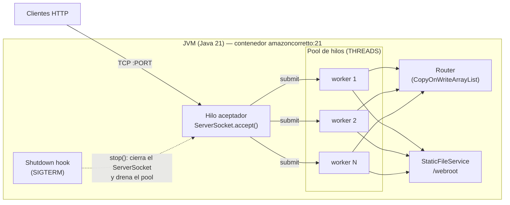
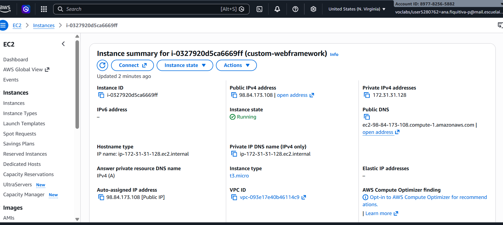
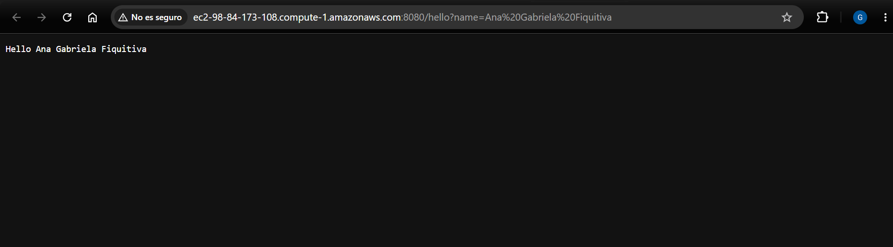

# Extensión del Framework Web — Concurrencia, Apagado Ordenado, Docker y AWS EC2

**Autora:** Ana Gabriela Fiquitiva Poveda
**Contexto académico:** Taller TDSE — Contenerización y despliegue de una aplicación web Java (extensión de la tarea)

Este repositorio contiene la extensión del framework web propio desarrollado en el curso, **sin Spring**: un servidor HTTP escrito sobre `java.net.ServerSocket` con registro de servicios `get(path, lambda)` y archivos estáticos. La extensión lo prepara para ejecutarse como servicio en contenedores y en la nube:

- ✅ Atención **concurrente** de solicitudes.
- ✅ **Apagado ordenado** (graceful shutdown), también ante `SIGTERM` de `docker stop`.
- ✅ **Puerto de escucha** leído de la variable de entorno `PORT`.
- ✅ Ejecución dentro de un **contenedor Docker**.
- ✅ Despliegue en **AWS EC2** (ver [Despliegue en AWS EC2](#despliegue-en-aws-ec2)).

Repositorio compañero (taller con Spring Boot): https://github.com/AnaFiquitiva/TDSE_Workshop-Containerizing-and-Deploying-a-Java-Web-Application_SpringBoot

## Tabla de contenido

1. [Estado inicial del framework](#estado-inicial-del-framework)
2. [Cambios introducidos en la extensión](#cambios-introducidos-en-la-extensión)
3. [Arquitectura](#arquitectura)
4. [Estructura del proyecto](#estructura-del-proyecto)
5. [Configuración por variables de entorno](#configuración-por-variables-de-entorno)
6. [Construcción y ejecución local](#construcción-y-ejecución-local)
7. [Ejecución en Docker](#ejecución-en-docker)
8. [Despliegue en AWS EC2](#despliegue-en-aws-ec2)
9. [Evidencia del progreso (commits)](#evidencia-del-progreso-commits)
10. [Pruebas automatizadas](#pruebas-automatizadas)
11. [Video de demostración](#video-de-demostración)
12. [Índice de evidencias](#índice-de-evidencias)

## Estado inicial del framework

El punto de partida es el framework del laboratorio anterior, [TDSE_Building-and-Deploying-a-Maintainable-Application-Server](https://github.com/AnaFiquitiva/TDSE_Building-and-Deploying-a-Maintainable-Application-Server), importado sin cambios en el commit [`ee4d9c7`](https://github.com/AnaFiquitiva/TDSE_Workshop-Containerizing-and-Deploying-a-Java-Web-Application_Framework-extension/commit/ee4d9c7ee4e4cdb0e46e588d21b239f81c0d39f6). Ya ofrecía:

- Registro de servicios REST con lambdas: `get("/hello", (req, resp) -> ...)`.
- Lectura de parámetros de consulta (`req.getValue("name")`).
- Archivos estáticos desde el classpath (`staticfiles("/webroot")`).
- Un endpoint `/shutdown` habilitado solo en `APP_ENV=development`.

Sus limitaciones para ejecutarse como servicio eran:

| Limitación | Consecuencia |
|---|---|
| El loop hacía `accept()` y atendía la conexión **en el mismo hilo**. | Una solicitud lenta bloqueaba a todos los demás clientes: el servidor era estrictamente secuencial. |
| `stop()` solo cambiaba una bandera. | `accept()` seguía bloqueado; el servidor no se detenía hasta que llegaba **otra** solicitud. |
| No había *shutdown hook*. | Ante `SIGTERM` (`docker stop`, Ctrl+C) el proceso moría de inmediato, cortando las solicitudes en curso. |
| El puerto se leía en la aplicación, no en el framework. | Cada aplicación tenía que repetir la lógica de `PORT`, sin validación. |
| Java 17 y Dockerfile basado en Temurin. | Distinto a la línea base del taller (Java 21, Amazon Corretto). |

## Cambios introducidos en la extensión

### 1. Atención concurrente de solicitudes — [`934f198`](https://github.com/AnaFiquitiva/TDSE_Workshop-Containerizing-and-Deploying-a-Java-Web-Application_Framework-extension/commit/934f198d1f5cbb37c7b1dec3c3aa48e0bbffe6d2)

- `HttpServer` separa **aceptar** de **atender**: el hilo principal solo ejecuta `accept()` y entrega cada socket a un pool fijo de hilos (`ExecutorService`), que parsea, despacha y responde.
- El tamaño del pool es configurable con la variable `THREADS` (16 por defecto). Un pool acotado limita el consumo de memoria ante ráfagas, a diferencia de crear un hilo por conexión.
- `Router` usa `CopyOnWriteArrayList`: las rutas se registran una vez al inicio y luego las leen muchos hilos a la vez, que es justo el patrón de acceso para el que está diseñada.
- Nuevo endpoint de demostración `/slow?ms=N` que simula un handler lento (máx. 10 s).

### 2. Apagado ordenado — [`260a502`](https://github.com/AnaFiquitiva/TDSE_Workshop-Containerizing-and-Deploying-a-Java-Web-Application_Framework-extension/commit/260a5026c8b94ab0e024c610ff242bfcc084a51a)

- `stop()` **cierra el socket de escucha**, lo que desbloquea `accept()` de inmediato: las conexiones nuevas se rechazan desde ese instante.
- Al salir del loop, el pool deja de aceptar trabajo (`shutdown()`) pero **termina las solicitudes en curso**; espera hasta 8 s (`awaitTermination`) y solo entonces fuerza el cierre (`shutdownNow()`). Los 8 s quedan por debajo de los 10 s de gracia de `docker stop`, para que el drenado termine antes del `SIGKILL`.
- `WebFramework` registra un **shutdown hook** de la JVM: ante `SIGTERM` detiene el servidor y espera a que termine el drenado antes de permitir que la JVM salga.
- `stop()` es idempotente y seguro desde cualquier hilo (incluido un handler, como `/shutdown`); `awaitTermination()` permite esperar el apagado.

### 3. Puerto por variable de entorno, Java 21 y Docker — [`d96e560`](https://github.com/AnaFiquitiva/TDSE_Workshop-Containerizing-and-Deploying-a-Java-Web-Application_Framework-extension/commit/d96e5609931db64b69303dabecac9d6d2878d2ea)

- `WebFramework.start()` lee `PORT` (8080 por defecto) y valida que sea un número entre 1 y 65535; un valor inválido detiene el arranque con un mensaje claro en lugar de un `NumberFormatException`.
- Migración a **Java 21** (`maven.compiler.release=21`).
- `Dockerfile` **multi-stage**: compila y ejecuta las pruebas con `maven:3.9-amazoncorretto-21`, y la imagen final solo contiene `amazoncorretto:21` + el JAR. El `ENTRYPOINT` en forma *exec* deja a `java` como PID 1, de modo que recibe el `SIGTERM` de `docker stop` directamente.

## Arquitectura



Secuencia de apagado:

```
SIGTERM / stop()
   │
   ├─► running = false; se cierra el ServerSocket ──► accept() lanza excepción ──► sale del loop
   │                                                   (conexiones nuevas: rechazadas)
   ├─► workers.shutdown()        ──► no se aceptan tareas nuevas; las que están en curso siguen
   ├─► workers.awaitTermination(8 s)
   │      ├─ terminaron  ──► "All in-flight requests completed."
   │      └─ timeout     ──► workers.shutdownNow()
   └─► "Server stopped gracefully."  ──► el shutdown hook libera a la JVM
```

## Estructura del proyecto

```
pom.xml
Dockerfile
src/main/java/co/edu/escuelaing/
├── app/Application.java                 — aplicación de ejemplo: /hello, /pi, /slow, /shutdown
└── webframework/
    ├── WebFramework.java                — API pública: get(), staticfiles(), start(), stop(); PORT, THREADS, shutdown hook
    ├── HttpServer.java                  — hilo aceptador, pool de workers, apagado ordenado
    ├── Router.java / Route.java         — registro y búsqueda de rutas
    ├── Request.java / Response.java     — parseo de la línea de solicitud y parámetros de consulta
    └── StaticFileService.java           — archivos estáticos desde el classpath
src/main/resources/webroot/              — index.html, app.js, styles.css, images/
src/test/java/co/edu/escuelaing/webframework/
├── ConcurrentRequestTest.java
├── GracefulShutdownTest.java
├── PortConfigurationTest.java
├── RequestTest.java
└── RouterTest.java
evidence/                                — salidas de comandos y capturas usadas como evidencia
```

### Endpoints de la aplicación de ejemplo

| Endpoint | Respuesta |
|---|---|
| `GET /` | Página estática (`index.html`) que consume `/hello` y `/pi`. |
| `GET /hello?name=Ana` | `Hello Ana` (prefijo configurable con `GREETING_PREFIX`). |
| `GET /pi` | `3.141592653589793` |
| `GET /slow?ms=2000` | Espera `ms` milisegundos y responde con el hilo que la atendió. Sirve para demostrar la concurrencia y el drenado. |
| `GET /shutdown` | Apagado ordenado. **Solo** si `APP_ENV=development` (en la imagen Docker está deshabilitado). |

## Configuración por variables de entorno

| Variable | Por defecto | Uso |
|---|---|---|
| `PORT` | `8080` | Puerto de escucha. Leído y validado por el framework. |
| `THREADS` | `16` | Tamaño del pool de hilos que atiende solicitudes. |
| `APP_ENV` | `development` (local) / `production` (imagen) | En `development` se habilita `/shutdown`. |
| `STATIC_FILES_PATH` | `/webroot` | Carpeta del classpath con los archivos estáticos. |
| `GREETING_PREFIX` | `Hello` | Prefijo de la respuesta de `/hello`. |

## Construcción y ejecución local

Requisitos: Java 21 y Maven 3.9+.

```bash
mvn clean package
java -jar target/webframework-jar-with-dependencies.jar            # escucha en 8080
PORT=8095 java -jar target/webframework-jar-with-dependencies.jar  # escucha en 8095
```

```bash
curl "http://localhost:8095/hello?name=Ana"
# Hello Ana
```

### Demostración de concurrencia

Cinco solicitudes a `/slow?ms=2000` lanzadas en paralelo terminan en ~2 s (no en ~10 s), cada una en un hilo distinto del pool.

**Evidencia** — [`evidence/concurrency_local.txt`](evidence/concurrency_local.txt):

```
Server listening on port 8095 with 16 worker threads

Done after 2000 ms on pool-1-thread-3
Done after 2000 ms on pool-1-thread-4
Done after 2000 ms on pool-1-thread-5
Done after 2000 ms on pool-1-thread-6
Done after 2000 ms on pool-1-thread-7

Tiempo total: 2183 ms   (un servidor secuencial necesitaría ~10000 ms)
```

### Demostración de apagado ordenado

Con una solicitud de 3 s en curso se invoca `/shutdown`: la solicitud en curso termina con 200, las conexiones nuevas se rechazan y el servidor se detiene **sin** necesitar otra conexión.

**Evidencia** — [`evidence/graceful_shutdown_local.txt`](evidence/graceful_shutdown_local.txt):

```
Server listening on port 8095 with 16 worker threads
Shutdown requested: no longer accepting new connections.
All in-flight requests completed.
Server stopped gracefully.
exit code: 0

$ curl "http://localhost:8095/pi"      # nueva conexión durante el apagado
conexión rechazada

# Resultado de la solicitud lenta que ya estaba en curso:
HTTP 200 -> Done after 3000 ms on pool-1-thread-2
```

## Ejecución en Docker

**Imagen en Docker Hub:** https://hub.docker.com/r/anafiquitivapoveda/custom-webframework (tags `1.0` y `latest`)

```bash
docker build -t anafiquitivapoveda/custom-webframework:1.0 .
docker tag anafiquitivapoveda/custom-webframework:1.0 anafiquitivapoveda/custom-webframework:latest

# Puerto por defecto (8080)
docker run -d --name fw-1 -p 34000:8080 anafiquitivapoveda/custom-webframework:1.0
# Puerto y tamaño del pool por variables de entorno
docker run -d --name fw-2 -e PORT=9000 -e THREADS=4 -p 34001:9000 anafiquitivapoveda/custom-webframework:1.0

docker push anafiquitivapoveda/custom-webframework:1.0
docker push anafiquitivapoveda/custom-webframework:latest
```

No hace falta compilar antes de `docker build`: la etapa `build` del Dockerfile compila y ejecuta las pruebas dentro de la imagen de Maven.

**Evidencia** — [`evidence/docker_run.txt`](evidence/docker_run.txt):

```
CONTAINER ID   IMAGE                                        STATUS         PORTS                     NAMES
0e84e8ce213e   anafiquitivapoveda/custom-webframework:1.0   Up 1 second    0.0.0.0:34001->9000/tcp   fw-2
51d0e2887ee8   anafiquitivapoveda/custom-webframework:1.0   Up 2 seconds   0.0.0.0:34000->8080/tcp   fw-1

$ docker logs fw-1
Server listening on port 8080 with 16 worker threads
$ docker logs fw-2
Server listening on port 9000 with 4 worker threads

$ curl "http://localhost:34000/hello?name=Docker"
Hello Docker
$ curl "http://localhost:34001/hello?name=Docker2"
Hello Docker2

# Concurrencia dentro del contenedor: 5 solicitudes /slow?ms=2000 en paralelo
Tiempo total: 2174 ms   (secuencial: ~10000 ms)
```

La misma imagen escucha en 8080 o en 9000 según `PORT`, sin recompilar.

### Apagado ordenado con `docker stop`

`docker stop` envía `SIGTERM` al PID 1 del contenedor (`java`), lo que dispara el shutdown hook del framework. Con una solicitud de 4 s en curso:

**Evidencia** — [`evidence/docker_graceful_shutdown.txt`](evidence/docker_graceful_shutdown.txt):

```
$ curl "http://localhost:34000/slow?ms=4000" &
$ docker stop fw-1                     # 0.7 s después
fw-1   (docker stop tardó 3789 ms: esperó a que terminara la solicitud, sin llegar al SIGKILL de los 10 s)

HTTP 200 -> Done after 4000 ms on pool-1-thread-8

$ docker logs fw-1
Server listening on port 8080 with 16 worker threads
Shutdown requested: no longer accepting new connections.
All in-flight requests completed.
Server stopped gracefully.

exited exit=143   # 128 + SIGTERM: salida normal tras el shutdown hook (SIGKILL sería 137)
```

## Despliegue en AWS EC2

Instancia `t3.micro` (`i-0327920d5ca6669ff`, `custom-webframework`) con Amazon Linux 2023 en `us-east-1`. Security group con entrada en TCP 22 (SSH) y TCP 8080 (aplicación).

```bash
sudo yum update -y
sudo yum install -y docker
sudo service docker start
sudo usermod -a -G docker ec2-user
# reconectar para que el nuevo grupo tenga efecto

docker pull anafiquitivapoveda/custom-webframework:1.0
docker run -d \
  --name custom-webframework \
  --restart unless-stopped \
  -e PORT=8080 \
  -p 8080:8080 \
  anafiquitivapoveda/custom-webframework:1.0
```

**URL pública de despliegue:** http://ec2-98-84-173-108.compute-1.amazonaws.com:8080/hello?name=AWS
*(verificada el 28/09/2026; la instancia se apaga después de la revisión para evitar cargos, así que puede no estar disponible — ver la evidencia a continuación)*

| Endpoint público | Respuesta |
|---|---|
| http://ec2-98-84-173-108.compute-1.amazonaws.com:8080/ | Página estática `index.html` |
| http://ec2-98-84-173-108.compute-1.amazonaws.com:8080/hello?name=AWS | `Hello AWS` |
| http://ec2-98-84-173-108.compute-1.amazonaws.com:8080/pi | `3.141592653589793` |

**Evidencia dentro de la instancia** — [`evidence/ec2_deployment.txt`](evidence/ec2_deployment.txt): `pull` con el mismo digest de la imagen construida localmente (`sha256:af41ba2ec0d4…`), contenedor en ejecución, concurrencia y apagado ordenado **en EC2**:

```
$ docker ps
CONTAINER ID   IMAGE                                        COMMAND               STATUS          PORTS                    NAMES
ccdb7cb3bacf   anafiquitivapoveda/custom-webframework:1.0   "java -jar app.jar"   Up 17 seconds   0.0.0.0:8080->8080/tcp   custom-webframework

$ docker logs custom-webframework
Server listening on port 8080 with 16 worker threads

$ curl "http://localhost:8080/hello?name=AWS"
Hello AWS

# 5 solicitudes /slow?ms=2000 en paralelo
Done after 2000 ms on pool-1-thread-5
Done after 2000 ms on pool-1-thread-2
Done after 2000 ms on pool-1-thread-1
Done after 2000 ms on pool-1-thread-4
Done after 2000 ms on pool-1-thread-3
real    0m2.050s

# docker stop con una solicitud de 4 s en curso
Done after 4000 ms on pool-1-thread-2
real    0m3.313s

$ docker logs custom-webframework
Server listening on port 8080 with 16 worker threads
Shutdown requested: no longer accepting new connections.
All in-flight requests completed.
Server stopped gracefully.
```

**Evidencia desde un cliente externo** — [`evidence/ec2_public_access.txt`](evidence/ec2_public_access.txt): solicitudes desde otra máquina a la URL pública, incluida la concurrencia a través de internet:

```
$ curl "http://ec2-98-84-173-108.compute-1.amazonaws.com:8080/hello?name=Ana%20Gabriela%20Fiquitiva"
Hello Ana Gabriela Fiquitiva

$ curl "http://ec2-98-84-173-108.compute-1.amazonaws.com:8080/pi"
3.141592653589793

$ curl -w "%{http_code} %{content_type}" "http://ec2-98-84-173-108.compute-1.amazonaws.com:8080/"
200 text/html; charset=utf-8

# 5 solicitudes /slow?ms=2000 en paralelo desde internet
Tiempo total: 2361 ms   (incluye la latencia de red; secuencial: >10000 ms)
```

Consola de EC2 con la instancia en ejecución:



Endpoint público desde el navegador:



> **Nota sobre el security group:** al principio las solicitudes externas al puerto 8080 se agotaban por tiempo, aunque dentro de la instancia `curl localhost:8080` respondía. Faltaba la regla de entrada TCP 8080; al agregarla, el endpoint quedó accesible. Esto muestra que el security group es la primera barrera de red del modelo: filtra el tráfico antes de que llegue a Docker o a la aplicación. Por las restricciones de la red de la universidad, las reglas de SSH (22) y de la aplicación (8080) se abrieron a `0.0.0.0/0` en lugar de limitarlas a una IP específica, como recomienda el taller.

## Evidencia del progreso (commits)

| Commit | Cambio |
|---|---|
| [`ee4d9c7`](https://github.com/AnaFiquitiva/TDSE_Workshop-Containerizing-and-Deploying-a-Java-Web-Application_Framework-extension/commit/ee4d9c7ee4e4cdb0e46e588d21b239f81c0d39f6) | Import base web framework from previous lab |
| [`934f198`](https://github.com/AnaFiquitiva/TDSE_Workshop-Containerizing-and-Deploying-a-Java-Web-Application_Framework-extension/commit/934f198d1f5cbb37c7b1dec3c3aa48e0bbffe6d2) | Implement concurrent request handling with a worker thread pool |
| [`260a502`](https://github.com/AnaFiquitiva/TDSE_Workshop-Containerizing-and-Deploying-a-Java-Web-Application_Framework-extension/commit/260a5026c8b94ab0e024c610ff242bfcc084a51a) | Implement graceful shutdown with connection draining and shutdown hook |
| [`d96e560`](https://github.com/AnaFiquitiva/TDSE_Workshop-Containerizing-and-Deploying-a-Java-Web-Application_Framework-extension/commit/d96e5609931db64b69303dabecac9d6d2878d2ea) | Read port from PORT env in framework, upgrade to Java 21 and containerize with Docker |

Historial completo: https://github.com/AnaFiquitiva/TDSE_Workshop-Containerizing-and-Deploying-a-Java-Web-Application_Framework-extension/commits/main

## Pruebas automatizadas

```bash
mvn test
```

| Clase | Qué verifica |
|---|---|
| `ConcurrentRequestTest` | 5 solicitudes de 1 s en paralelo terminan en menos de 2 s (un servidor secuencial tardaría 5 s). |
| `GracefulShutdownTest` | `stop()` detiene el servidor sin necesitar otra conexión; una solicitud en curso termina con 200 mientras las conexiones nuevas se rechazan; `stop()` es idempotente. |
| `PortConfigurationTest` | `PORT` ausente → 8080; valor válido → ese puerto; valores no numéricos o fuera de 1–65535 → error. |
| `RequestTest`, `RouterTest` | Parseo de solicitudes y búsqueda de rutas (heredadas del framework base). |

Resultado: `Tests run: 18, Failures: 0, Errors: 0, Skipped: 0`.

## Video de demostración

📹 **Video:** https://youtu.be/rp4x85QmN98

El video muestra:
1. El historial de commits de la extensión y la ejecución de las pruebas automatizadas.
2. La imagen publicada en Docker Hub y dos contenedores de la misma imagen con `PORT` y `THREADS` distintos.
3. La concurrencia: 5 solicitudes lentas en paralelo atendidas en ~2 s por hilos distintos.
4. El apagado ordenado con `docker stop` y una solicitud en curso.
5. El despliegue en AWS EC2: instancia en ejecución, contenedor en la VM y endpoint público respondiendo.

Video del Repo 1 (taller con Spring Boot): https://youtu.be/k8HInEJ6VzE

## Índice de evidencias

| Archivo | Contenido |
|---|---|
| `concurrency_local.txt` | Ejecución local: 5 solicitudes lentas en paralelo atendidas por hilos distintos. |
| `graceful_shutdown_local.txt` | Ejecución local: `/shutdown` con una solicitud en curso; conexiones nuevas rechazadas. |
| `docker_run.txt` | Imagen construida, dos contenedores con `PORT` distinto, respuestas y concurrencia en Docker. |
| `docker_graceful_shutdown.txt` | `docker stop` (SIGTERM) con una solicitud en curso: drenado y logs del apagado. |
| `ec2_deployment.txt` | Dentro de EC2: `pull`, `run`, `docker ps`, `docker logs`, concurrencia y `docker stop` con drenado. |
| `ec2_public_access.txt` | Desde un cliente externo: `/hello`, `/pi`, `/` y concurrencia contra la URL pública. |
| `ec2_instance_running_console.png` | Consola de AWS con la instancia en estado `Running`. |
| `ec2_browser_screenshot.png` | Navegador mostrando el endpoint público. |
